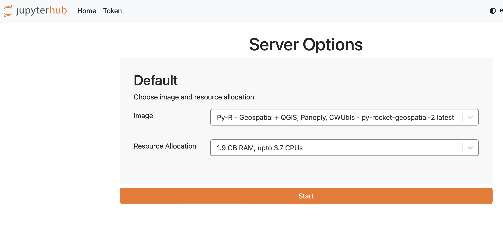

# Checklist
## Required setup

```{attention}
Please make sure to find some time to go through the below material before
the hackweek.

__Here is a checklist of things you need to do in advance__:
<div>
  <input type="checkbox" name="a2">
  <label for="a2">Create an EarthData Login</label>
</div>
<div>
  <input type="checkbox" name="a3">
  <label for="a3">Create a GitHub account</label>
</div>
<div>
  <input type="checkbox" name="a4">
  <label for="a4">Login to the JupyterHub</label>
</div>
<div>
  <input type="checkbox" name="a5">
  <label for="a5">Review material the Resource Book linked on the website.</label>
</div>
<div>
  <input type="checkbox" name="a5">
  <label for="a5">Review material on PACE before the hackweek (Optional)</label>
</div>
```

### EarthData Login

Each participant will need an Earthdata login to access NASA data. You will need to know your Earthdata username and password. 
If you do not already have an Earthdata login, then navigate to the Earthdata login [page](https://urs.earthdata.nasa.gov/),
register, and record username and password somewhere for use during the hackweek. 

### GitHub Account

[GitHub](https://github.com/) enables us to collaborate on code across teams in a web environment. If you do not already have a GitHub account, then navigate to [GitHub](https://github.com/), enter your email address and click on the green ‘Sign up for GitHub’ button. Be sure to save your username 
and password somewhere for use during the hackweek.

### Hackweek JupyterHub

We will be using a pre-provisioned compute environment for the hackweek which can be accessed via a web browser. You will not need to install anything.
Please follow these instructions which will guide you through gaining access to the JupyterHub. 

1. [Watch this video](https://youtu.be/uZ2Uy376Az8) to get an orientation on our JupyterHub.

2. Sign in by navigating to the [JupyterHub](https://workshop.nmfs-openscapes.2i2c.cloud/). Instructions to sign in are in our Slack channel [here](https://fish-pace.slack.com/files/U09FQF586KU/F09FRKRN5PC/hub.md) and were sent to you via email.

3. You will see server options. To start, you can stay with the default image and RAM. It can take several minutes for new servers to launch on the cloud. Once things are spun up, you will see your very own instance of a JupyterLab environment. 



You will have access to your own virtual drive space under the `/home/jovyan` directory. No other users will be able to see or access your data files. You can add/remove/edit files in your virtual drive space. You will also have access to the  *`shared-public`* folder (read and write access). These are shared spaces so please make sure not to delete files from here unless they are yours.

4. *To save our community money, when you are finished working for the day it is helpful for you to explicitly stop your server before logging out of your JupyterHub session.* To shut your server down immediately when you’re exiting your session please select “File -> Hub Control Panel -> Stop my Server” then you can click the “Log Out” button. We ask this because when you keep a session active it uses up AWS resources and these resources cost money per hour of use. If you forget this step, though, the server will shut down automatically after 90 min of no use.
Logging out will **NOT** cause any files under `/home/jovyan` to be deleted. It is equivalent to turning off your desktop computer at the end of the day.


### Pre-HackWeek Learning (Optional) 

If interested, please review course material from prior events:

- 2022 PACE course *What’s behind the curtain of the NASA PACE mission?* All lecture recordings and presentation PDFs can be accessed [here.](https://www.us-ocb.org/pace-mission-training-activity/)
- 2024 PACE hackweek All lecture recordings and presentation PDFs can be accessed [here](https://pacehackweek.github.io/pace-2024/)
- 2025 PACE hackweek All lecture recordings and presentation PDFs can be accessed [here](https://pacehackweek.github.io/pace-2025/)
- Introduction to PACE data for Water Quality Monitoring (ARSET) [here](https://appliedsciences.nasa.gov/get-involved/training/english/arset-introduction-plankton-aerosol-cloud-ocean-ecosystem-pace)
- Monitoring HAB indicators for aquaculture (ARSET) [here](https://www.earthdata.nasa.gov/learn/trainings/monitoring-harmful-algal-bloom-indicators-aquaculture-using-nasa-remote-sensing)
- Hyperspectral data for land and coastal ecosystems [here](https://www.earthdata.nasa.gov/learn/trainings/hyperspectral-data-land-coastal-systems)
- Applications of PACE data for for aquaculture and fisheries management. Background. [here](https://ocean-satellite-tools.github.io/hyper-fish-book/)
- Introduction to using earth data in the cloud for scientific workflows: PACE hyperspectral ocean color data [here](https://nmfs-opensci.github.io/EDMW-EarthData-Workshop-2025/) Tutorials have links to run in Colab. You do not need to install anything.
- Abundance of good material on the [PACE Applications website](https://pace.oceansciences.org/applications.htm). Check out the quarterly newsletters.

*How do I run the tutorials if I don't have Python and all the packages installed?* Once you are in the Fish-PACE slack, we'll provide a link to our workshop compute environment (a JupyterHub). However, you can run 95% of the tutorials in [Colab](https://colab.research.google.com/). [nice intro to Colab for complete beginners](https://www.youtube.com/watch?v=Xi9-W26cDBs).

